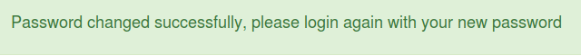

# TPC 10 - Aula 12

## Pergunta 1 - *SQL Injection*

## Pergunta 2 - *XSS*

## Pergunta 3 - *Password Reset*

Utilizando o *WebGoat* a lição A2 *Broken Authentication > Password Reset* serve como forma de testar ataques a *Password Reset*.

A lição começa por testar o acesso ao *e-mail* do *WebWolf*, para garantir que está operacional. Em seguida é explicado como verificar se uma conta existe.

O ponto seguinte consiste em ativar a recuperação de *password* a partir do *username* e de uma pergunta de segurança (por força bruta) tentar submeter uma tentativa de recuperação de *password* (através de Força Bruta).

Tento isto em mente são explicadas quais os tipos de perguntas de segurança são mais adequados, levando à conclusão que as melhores perguntas são as que têm uma resposta fácil de memorizar mas difícil de descobrir.

Por fim, é criado um *link* para resetar a *password* do *e-mail tom@webgoat-cloud.org*. É neste passo que é concluída a *Password Reset*.

## Pergunta 4 - *Vulnerable components*

Como forma de entender melhor os componentes vulneráveis o *WebGoat* têm a lição A9 *Vulnerable Components*.

O processo da lição inicia-se com uma explicação do que são ecossistemas *Open Source* e a razão pela qual este problema de componentes vulneráveis está no top 10 do *OWASP*. Em seguida é mostrado que os componentes estão em todo lado e que até no *WebGoat* existem imensos componentes de risco.

Depois de uma introdução, são apresentados dois exemplos de vulnerabilidades que não estão no "nosso" código (*jquery-ui:1.10.4* e *jquery-ui:1.12.0 Not Vulnerable*). 

No passo seguinte são introduzidas formas de gerar listas de componentes que estão a ser utilizados de forma a identificar quais os que representam risco.

Na parte final da lição é explicado o que é sobrecarga de informação de segurança, informações de arquitetura e alguns exemplos de riscos *OSS*. Por fim, é feito um exercício de exploração da vulnerabilidade *VE-2013-7285 (XStream)*, ou seja, a partir da introdução de uma representação *XML* de um contacto e o *XStream.fromXML(xml)* é possível converter esse *XML* para um contacto.