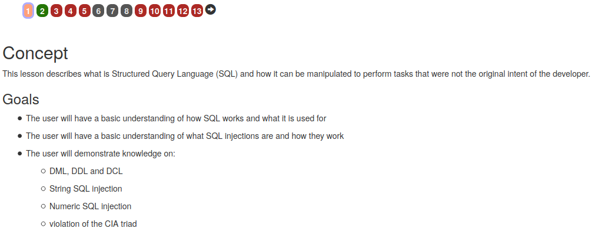
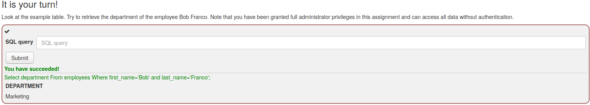
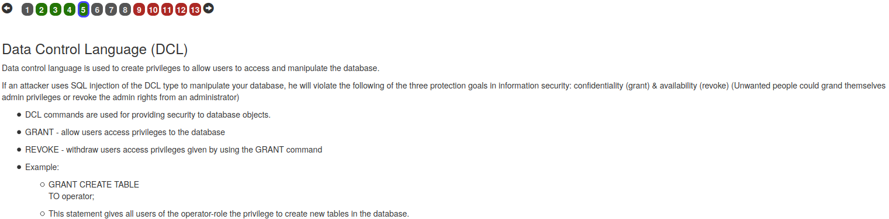
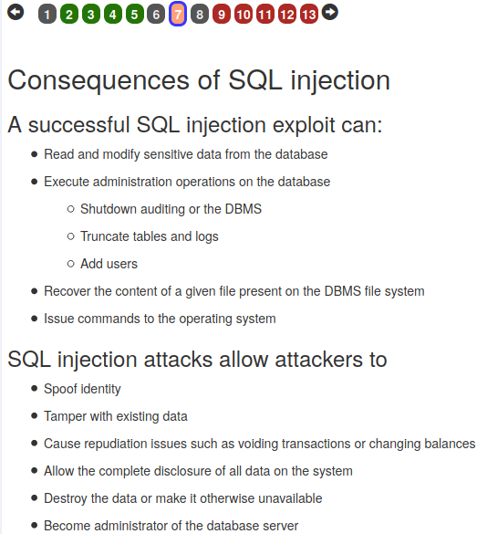
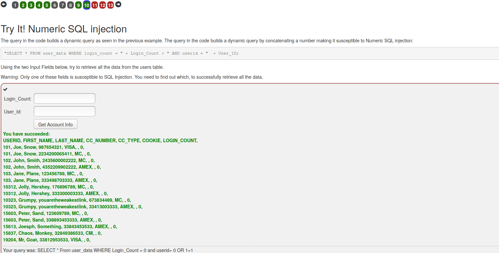
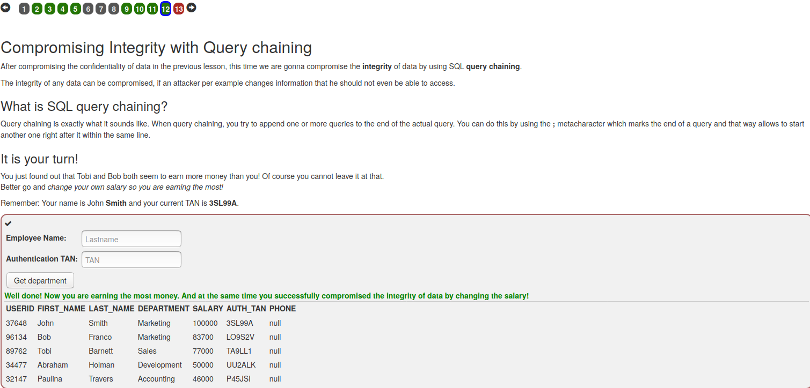

# TPC 10 - Aula 12

## Pergunta 1 - *SQL Injection*

### Passo 1 - Apenas informação



### Passo 2 - Realização de uma *query* SQL


#### Solução

Apenas uma simples *query* SQL.



### Passo 3 - Query de manipulação


#### Solução 

Apenas era necessário a introdução de uma simples *query* SQL.


### Passo 4 - Query de alteração/modificação de tabelas


#### Solução 

Mais uma vez a solução apenas a construção de uma *query* SQL.


### Passo 5 - Query de alteração de permissões



#### Solução 

Mais uma vez a solução apenas a construção de uma *query* SQL.


### Passo 6 - Passo informativo


### Passo 7 - Passo informativo



### Passo 8 - Passo informativo


### Passo 9 - *String* SQl *Injection* 


#### Descrição do passo e explicação da solução 

Para fechar a apóstrofe e o *last_name* temos de introduzir o nome ```Smith``` seguido de apóstrofe. Para obter a informação sem ter as informações corretas insere-se o ```1=1```, ou seja, verdadeiro. Os apóstrofes também devem corresponder.

### Passo 10 - *Number* SQl *Injection* 



#### Descrição do passo e explicação da solução 

Neste caso, não existe um problema obvio com as aspas ou apóstrofes. Na segunda variável usa-se o mesmo truque que no passo anterior, ou seja, ```OR 1=1```. Neste caso, os números postos no primeiro campo ou antes do **OR** não eram importantes. A solução final está na imagem em cima.

### Passo 11 - *Compromising confidentiality with String* SQl *Injection* 


#### Descrição do passo e explicação da solução 

Mais uma vez, a repitação do processo das queries anteriores, desta feita, era um pouco mais difícil lidar com as aspas e apóstrofes. A solução final está na imagem em cima.

### Passo 12 - *Compromising Integrity* com *Query chaining* 



#### Solução 

- Employee Name - ```Smith```
- Authentication TAN - ```3SL99A'; UPDATE employees SET salary=100000 WHERE last_name='Smith```


### Passo 13 - *Compromising Availability* 


#### Solução 

Neste caso, a solução neste caso era apagar como complemento a tabela. Usando o que foi visto no passo informativo número 6, a solução era a seguinte: ```'; DROP TABLE access_log;--```.

## Pergunta 2 - *XSS*

## Pergunta 3 - *Password Reset*

Utilizando o *WebGoat* a lição A2 *Broken Authentication > Password Reset* serve como forma de testar ataques a *Password Reset*.

A lição começa por testar o acesso ao *e-mail* do *WebWolf*, para garantir que está operacional. Em seguida é explicado como verificar se uma conta existe.

O ponto seguinte consiste em ativar a recuperação de *password* a partir do *username* e de uma pergunta de segurança (por força bruta) tentar submeter uma tentativa de recuperação de *password* (através de Força Bruta).

Tento isto em mente são explicadas quais os tipos de perguntas de segurança são mais adequados, levando à conclusão que as melhores perguntas são as que têm uma resposta fácil de memorizar mas difícil de descobrir.

Por fim, é criado um *link* para resetar a *password* do *e-mail tom@webgoat-cloud.org*. É neste passo que é concluída a *Password Reset*.


## Pergunta 4 - *Vulnerable components*

Como forma de entender melhor os componentes vulneráveis o *WebGoat* têm a lição A9 *Vulnerable Components*.

O processo da lição inicia-se com uma explicação do que são ecossistemas *Open Source* e a razão pela qual este problema de componentes vulneráveis está no top 10 do *OWASP*. Em seguida é mostrado que os componentes estão em todo lado e que até no *WebGoat* existem imensos componentes de risco.

Depois de uma introdução, são apresentados dois exemplos de vulnerabilidades que não estão no "nosso" código (*jquery-ui:1.10.4* e *jquery-ui:1.12.0 Not Vulnerable*). 

No passo seguinte são introduzidas formas de gerar listas de componentes que estão a ser utilizados de forma a identificar quais os que representam risco.

Na parte final da lição é explicado o que é sobrecarga de informação de segurança, informações de arquitetura e alguns exemplos de riscos *OSS*. Por fim, é feito um exercício de exploração da vulnerabilidade *VE-2013-7285 (XStream)*, ou seja, a partir da introdução de uma representação *XML* de um contacto e o *XStream.fromXML(xml)* é possível converter esse *XML* para um contacto.