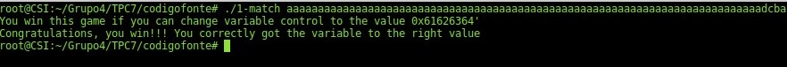

# TPC 7 - Aula 9

## Exercício 1 - **Buffer Overflow**

### Pergunta 1.1 - *Buffer overflow* em várias linguagens

O programa 'LOverflow2', está escrito em 3 linguagens diferente, *Java*, *Python* e *C++*. Começa por pedir a introdução de quantos números se pretende introduzir. De seguida, os números, são lidos e armazenados num *array* estático, com 10 posições, tantos números quantos os indicados inicialmente.

O problema deste programa encontra-se na ausência de verificação do primeiro valor inserido, isto é, se a quantidade de números que se pretende indicar é inferior ou igual a 10. Para além disso, não é validado se o input introduzido corresponde a um inteiro.

Dessa forma, as situações consideradas para teste do programa são:

+ Inserção de um número com valor muito grande;
+ Inserção de uma quantidade de números muito superior a 10;
+ Inserção de letras, em vez de números;
+ Inserção de uma quantidade de números negativa;
+ Inserção de uma operação (no caso da linguagem *Python*).

#### Java

Relativamente ao programa escrito em *Java*, verificou-se que nos casos de inserção de valores muito elevados ou com inputs não inteiros, é lançada uma exceção. Para além disso, quando é inserida uma quantidade de números negativa, não é solicitado nenhum valor. O output gerado pelo programa *Java* para estas situações é apresentado na imagem que se segue.


#### Python

Quanto ao programa escrito em *Python*, continuou a verificar-se o lançamento de exceções no caso da introdução de inteiros demasiado elevados. Na introdução de uma quantidade de números negativa, ainda se constatou que simplesmente não era solicitado nenhum valor.

Um aspeto curioso que se verifica com o recurso à função input do *Python*, é que a expressão lida do *stdin* é executada. Assim, a introdução de 1+3 é equivalente à introdução do *input* 4.

Todas estas experiências são apresentadas na imagem que se segue.


#### C++

Em último lugar, para o programa escrito em *C++*, verificou-se que após indicação de uma quantidade de números válida, caso se introduza um valor que cause overflow, as restantes solicitações de valores são impressas e o programa termina, sem introdução de mais qualquer input por parte do utilizador.


Verificou-se também que a inserção de uma quantidade de números ligeiramente superior ao suportado (10), faz com que de seguida sejam solicitados mais valores do que o indicado. Caso se introduza uma quantidade de números bastante superior, o programa começa a solicitar a inserção de números repetidamente, sem parar, conforme se pode verificar na figura apresentada de seguida.


Quando se inserem *inputs* que não sejam inteiros no campo de quantos números o programa simplesmente termina.


Por fim, a introdução de uma quantidade de números negativa continua a ter o mesmo resultado que para as restantes linguagens, isto é, não é solicitada a inserção de nenhum valor.


### Pergunta 1.2 - *Root Exploit*

O programa *RootExploit.c* tem o seguinte algoritmo:

1. Lê uma password através da função *gets*.
2. Compara o valor lido com a string *"csi1"*.
3. Se for igual então a variável *pass* ficam com o valor 1.
4. Se *pass* for 1, então tem-se permissões de *root/admin*.

O problema está na utilização da função *gets*, uma vez que esta não verifica o tamanho do *input* e o compara com o tamanho alocado para a variável que vai armazenar esse *input*. Desta forma, dado que *buff* é um *array* de 4 posições e a última está ocupado pelo '\0', apenas se pode introduzir 3 caracteres. No entanto, se o utilizador continuar a escrever o programa continua a escrever para lá dos limites do *buff*.

Desta forma, se se continuarmos a escrever no *buff* para além dos seus limites, começa-se a escrever na variável *pass* e alterara-se o seu valor.


Aqui, o input preencheu as 3 primeiras posições do *buff*, o '\0' e por fim o último 1 escreveu na variável *pass*. Assim, apesar da password estar errada, a variável *pass* ficou a 1 e obteve-se privilégios de *root/admin*.

---

O programa *0-simple.c* tem o seguinte algoritmo:

1. A variável *control* é inicializada a 0.
2. É lida uma *password* através da função *gets*.

Se a variável *control* for diferente de 0, ganha-se.
Da mesma forma, este programa utiliza a função *gets* que não é segura como já foi referido anteriormente. Assim é possível através da variável *buffer* corromper a memória e escrever na variável *control*.


Inserindo um input suficientemente grande para encher o *buffer* e cobrir a memória até à variável *control* conseguimos colocar a variável diferente de 0 e ganhar.

### Pergunta 1.3 - *Read Overflow*

O programa *ReadOverflow.c* tem o seguinte algoritmo:

1. Lê uma quantidade de caracteres através da função *fgets*.
2. Converte o valor lido para inteiro (n) através da função *atoi*.
3. Lê uma frase através da função *fgets*.
4. Imprime os primeiros n caracteres presentes no *buffer*.
5. Regressa a 1.

A utilização da função *fgets* já efetua uma validação do tamanho do input introduzido, sendo lido apenas tantos caracteres quantos puderem ser armazenados no *buffer* associado.

Contudo, o valor introduzido no passo 1 deve ser um inteiro, o que não é validado neste programa. A utilização da função *atoi* faz com que só seja lido os inteiros no início do input, antes de qualquer *caracter* não numérico. Assim, se for introduzida uma letra, por exemplo, o inteiro ficará com o valor 0.

A introdução de um inteiro negativo para o número de caracteres fará com que sejam impressos 0 caracteres da frase.


Contudo o *buffer* não é limpo e o número de caracteres indicado não é comparado com o tamanho da string inserida, há a possibilidade de ocorrência de um *read overflow*. Ou seja, consegue-se ler conteúdo de zonas do *buffer* que não foram escritas pela frase inserida, mas sim por outras anteriores.


### Pergunta 1.4 

#### Funcionamento do programa

O programa ```1-match.c``` recebe um argumento, um array de *chars*, dado pelo utilizador e aloca duas variáveis: um inteiro (```control```) e um *array* de carateres fixo de tamanho 64 (```buffer```). O ```control``` vai ser inicializado a zero, enquanto que para o *array* ```buffer``` vai ser copiada a informação dada pelo *user*.

O grande problema deste programa é o uso da função ```strcpy``` para copiar algo para um *array* fixo. Isto é, como o tamanho do array é 64, se a *string* dada pelo utilizdor for maior que 64, os primeiros 64 carateres serão bem copiados para o *array* ```buffer``` mas, os restantes, vão fazer com que o *buffer* sofra um *oveflow*.

#### Passos para explorar a variável

Para manipular a variável *control* de forma a obter o resultado pretendido foi necessário seguir os seguintes passos:

- Utilizar o *gdb* para descobrir os endereços das variáveis *control* (0x7fffffffe6fc) e *buffer* (0x7fffffffe6b0).
- Calcular a diferença entre os endereços: 76.
- Passar o valor pretendido da variável ```control``` do formato hexadecimal para *ASCII*: ```0x61626364``` -> ```abcd```.
- Introduzir o input correto. Como existem 76 bytes entre as variáveis, é necessário introduzir uma string de 80 carateres para alterar completamente o valor da variável ```control``` (devido ao *overflow*) - 76 para a diferença, 4 para a variável (int - 4 bytes). Assim sendo, caso a máquina fosse *big endian*, os valores seriam anexados do maior para o mais pequeno, ou seja, para se conseguir obter os resultados pretendidos os últimos 4 carateres deviriam ser ```abcd```. Mas, como, a máquina é *little endian*, os últimos 4 carateres tem de ser ```dcba``` para obter 0x61626364.

#### Resultados



### Pergunta 1.5 - Buffer overflow na Heap

O código melhorado pode ser encontrado [aqui](https://github.com/uminho-miei-engseg-19-20/Grupo4/blob/master/TPC7/codigofonte/overflowHeap.1.c).

Métodos de programação defensiva utilizados:

- **Evite funções de risco** - em vez da tradicional ```strcpy``` foi utilizada a função ```strncpy```, que protege o programa contra os *buffer overflow*.
- **Alocar memória** - em vez de simplesmente, não copiar o que não tinha espaço para copiar, seria uma boa prática alocar mais espaço de modo a escrever todo o que o utilizador introduziu.

### Pergunta 1.6 - Buffer overflow na Stack

Métodos de programação defensiva que devem ser usados:

- **Evite funções de risco** - em vez da tradicional ```strcpy``` foi utilizada a função ```strncpy```, que protege o programa contra os *buffer overflow*.
- **Espaço alocado** - alocar o espaço suficiente (517) para conseguir copiar a string sem problemas de *buffer overflow*.
- **Alocar memória** - se for necessário um *array* maior, alocar mais memória.
