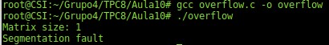
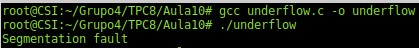

# TPC 8 - Aula 10

## Pergunta 1.1

### 1.

A vulnerabilidade encontrada na função ```vulneravel``` diz respeito aos argumentos ```x``` e ```y```, que são inteiros *unsigned*. A máquina tem um valor limite que consegue representar, se um destes valor ou o valor da multiplicação de ambos ultrapassar este limite, o número não dá para representar, como tal vai ser atribuído o valor 1. Assim, é alocado muito menos espaço do que era pretendido e, quando o programa começar a escrever na matriz, este irá escrever em locais de memória não pretendidos e não alocados para a variável ```matriz```. Desta forma, irá acontecer um *segmentation fault*.

### 2.

Código da função ```main``` alterado para demonstrar a vulnerabilidade:

```
#include <stdio.h>
#include <stdlib.h>

void vulneravel (char *matriz, size_t x, size_t y, char valor) {
    int i, j;
    matriz = (char *) malloc(x*y);

    for (i = 0; i < x; i++) {
        for (j = 0; j < y; j++) {
            matriz[i*y+j] = valor;
        }
    }
}

int main() {

    char *matrix;
    size_t x = 2147483649;
    size_t y = 2147483649;
    printf("Matrix size: %d\n", x*y);
    vulneravel(matrix,x,y,'1');

    return 0;
}
```

### 3.

Como já era de esperar ao executar a função usando valores de *input* muito grandes, o programa dá erro de *Segmentation Fault* pois tenta escrever em locais de memório não alocados para a variável ```matriz```.



## Pergunta 1.2

### 1.

A vulnerabilidade encontrada na função ```vulneravel``` diz respeito ao argumento ```tamanho```. O código e a utilização do tipo *size_t* garante que o valor da variável tamanho está entre **0** e **MAX_SIZE**. Assim, nesse caso, a variável ```tamanho_real```, que é usada para alocar espaço para a *string* ```destino```, vai estar contida entre **0** e **MAX_SIZE-1**. Caso, a variável ```tamanho``` tenha valores **0** ou **1** vai-se verificar um *underflow*, uma vez que não irá ser possível alocar memória para a variável ```destino```, fazendo com que esta seja *NULL*, o que irá causar problemas na função ```memcpy```.

### 2.

Código da função ```main``` alterado para demonstrar a vulnerabilidade:

```
#include <stdio.h>
#include <stdlib.h>
#include <string.h>

const int MAX_SIZE = 2048;

void vulneravel (char *origem, size_t tamanho) {

    size_t tamanho_real;
    char *destino;

    if (tamanho < MAX_SIZE) {
        tamanho_real = tamanho - 1; // Não copiar \0 de origem para destino
        destino = (char *) malloc(tamanho_real);
        memcpy(destino, origem, tamanho_real);
    }
}

int main() {
    char *origem = "Underflow";
    vulneravel(origem, 0);
}
```

### 3.

O programa dá *Segmentation Fault* quando tenta executar a função ```memcpy``` porque, neste caso, a variável ```destino``` é **NULL** (não é alocada memória anteriormente).



### 4.

#### 4.1

```
#include <stdio.h>
#include <stdlib.h>
#include <string.h>

const int MAX_SIZE = 2048;

void vulneravel (char *origem, size_t tamanho) {

    size_t tamanho_real;
    char *destino;

    if (tamanho > 1 && tamanho < MAX_SIZE) {
        tamanho_real = tamanho - 1; // Não copiar \0 de origem para destino
        destino = (char *) malloc(tamanho_real);
        memcpy(destino, origem, tamanho_real);
    } else {
        printf("Invalid input\n");
    }
}

int main() {
    char *origem = "Underflow";
    vulneravel(origem, 0);
}
```

Para mitigir as vulnerabilidade no programa as técnicas de programação defensiva utilizadas foram: verificar o *input* e validar possíveis *underflows* e *overflows*. Ou seja, com a condição extra no *if* obrigamos a que o programa aloque sempre memória e conseguia fazer sempre a operação de ```memcpy``` com sucesso.
